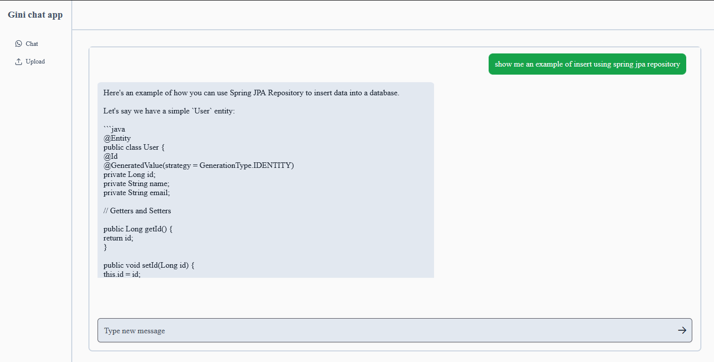
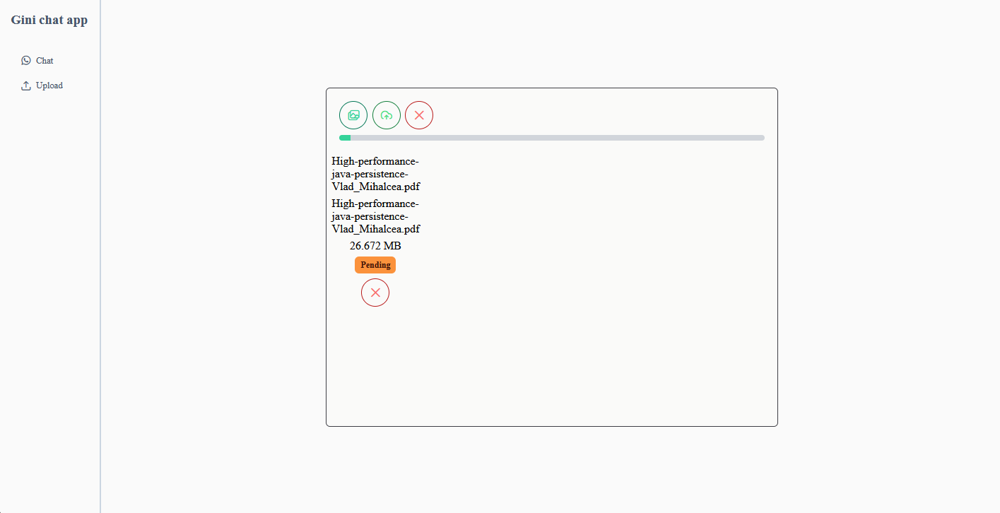

# AI core service 2

### Reference Documentation

Testing Spring AI:

* Tools
* RAG
* Prompts
* Advisors
* Structured output

### RAG:
Using OpenAi API with Ollama and PG-vector database.

### UI

